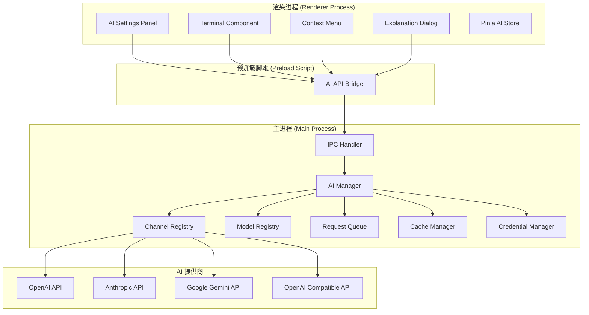

# Design Document: AI Assistant Integration

## Overview

本设计文档描述了 MShell AI 助手功能的技术实现方案。AI 助手将集成到 SSH 终端中，为用户提供代码撰写、解释和优化功能。系统采用模块化设计，支持多个 AI 提供商（OpenAI、Anthropic、Google Gemini 及 OpenAI 兼容 API），通过主进程管理 AI 请求，渲染进程提供用户界面。

### 技术栈

- **AI SDK**:
  - `openai` (^4.0.0): OpenAI 官方 SDK
  - `@anthropic-ai/sdk` (^0.20.0): Anthropic Claude SDK
  - `@google/generative-ai` (^0.1.0): Google Gemini SDK
- **HTTP 客户端**: `axios` (^1.6.0): 用于 OpenAI 兼容 API
- **语言检测**: 自定义实现（基于关键字和语法特征）
- **Markdown 渲染**: `marked` (^11.0.0): 渲染 AI 解释内容
- **加密存储**: Electron safeStorage API (使用 Windows DPAPI)
- **现有技术栈**: Electron 28+, Vue 3, TypeScript, Pinia

### 架构原则

1. **安全优先**: API Key 加密存储，不在日志中记录敏感信息
2. **进程隔离**: AI 请求在主进程处理，避免阻塞渲染进程
3. **可扩展性**: 支持添加新的 AI 提供商，统一接口设计
4. **用户体验**: 异步处理，加载指示器，错误友好提示
5. **性能优化**: 请求缓存，超时控制，取消机制

## Architecture

### 系统架构图



### 进程通信模型

**主进程 → 渲染进程**:
- 事件: `ai:progress`, `ai:complete`, `ai:error`, `ai:cancelled`

**渲染进程 → 主进程**:
- 调用: `ai:addChannel`, `ai:updateChannel`, `ai:deleteChannel`, `ai:verifyChannel`, `ai:getAllChannels`
- 调用: `ai:fetchModels`, `ai:addModel`, `ai:deleteModel`, `ai:getAllModels`, `ai:setDefaultModel`
- 调用: `ai:request`, `ai:cancelRequest`, `ai:updateConfig`, `ai:getConfig`

### IPC 接口定义

```typescript
// electron/ipc/ai-handlers.ts
export function registerAIHandlers(ipcMain: IpcMain, aiManager: AIManager) {
  // 渠道管理
  ipcMain.handle('ai:addChannel', async (_event, data) => {
    return await aiManager.addChannel(data);
  });
  
  ipcMain.handle('ai:updateChannel', async (_event, id, updates) => {
    return await aiManager.updateChannel(id, updates);
  });
  
  ipcMain.handle('ai:deleteChannel', async (_event, id) => {
    return await aiManager.deleteChannel(id);
  });
  
  ipcMain.handle('ai:verifyChannel', async (_event, id) => {
    return await aiManager.verifyChannel(id);
  });
  
  ipcMain.handle('ai:getAllChannels', async () => {
    return aiManager.getAllChannels();
  });
  
  // 模型管理
  ipcMain.handle('ai:fetchModels', async (_event, channelId) => {
    return await aiManager.fetchModels(channelId);
  });
  
  ipcMain.handle('ai:addModel', async (_event, data) => {
    return await aiManager.addModel(data);
  });
  
  ipcMain.handle('ai:deleteModel', async (_event, id) => {
    return await aiManager.deleteModel(id);
  });
  
  ipcMain.handle('ai:getAllModels', async () => {
    return aiManager.getAllModels();
  });
  
  ipcMain.handle('ai:setDefaultModel', async (_event, modelId) => {
    return await aiManager.setDefaultModel(modelId);
  });
  
  // AI 请求
  ipcMain.handle('ai:request', async (_event, action, content, language) => {
    return await aiManager.request(action, content, language);
  });
  
  ipcMain.handle('ai:cancelRequest', async (_event, requestId) => {
    return await aiManager.cancelRequest(requestId);
  });
  
  // 配置管理
  ipcMain.handle('ai:updateConfig', async (_event, updates) => {
    return await aiManager.updateConfig(updates);
  });
  
  ipcMain.handle('ai:getConfig', async () => {
    return aiManager.getConfig();
  });
}
```

### Preload API 暴露

```typescript
// electron/preload.ts (添加到 electronAPI)
ai: {
  // 渠道管理
  addChannel: (data: any) => ipcRenderer.invoke('ai:addChannel', data),
  updateChannel: (id: string, updates: any) => ipcRenderer.invoke('ai:updateChannel', id, updates),
  deleteChannel: (id: string) => ipcRenderer.invoke('ai:deleteChannel', id),
  verifyChannel: (id: string) => ipcRenderer.invoke('ai:verifyChannel', id),
  getAllChannels: () => ipcRenderer.invoke('ai:getAllChannels'),
  
  // 模型管理
  fetchModels: (channelId: string) => ipcRenderer.invoke('ai:fetchModels', channelId),
  addModel: (data: any) => ipcRenderer.invoke('ai:addModel', data),
  deleteModel: (id: string) => ipcRenderer.invoke('ai:deleteModel', id),
  getAllModels: () => ipcRenderer.invoke('ai:getAllModels'),
  setDefaultModel: (modelId: string) => ipcRenderer.invoke('ai:setDefaultModel', modelId),
  
  // AI 请求
  request: (action: string, content: string, language?: string) => 
    ipcRenderer.invoke('ai:request', action, content, language),
  cancelRequest: (requestId: string) => ipcRenderer.invoke('ai:cancelRequest', requestId),
  
  // 配置管理
  updateConfig: (updates: any) => ipcRenderer.invoke('ai:updateConfig', updates),
  getConfig: () => ipcRenderer.invoke('ai:getConfig'),
  
  // 事件监听
  onProgress: (callback: (requestId: string, progress: number) => void) => {
    ipcRenderer.on('ai:progress', (_event, requestId, progress) => callback(requestId, progress));
  },
  onComplete: (callback: (requestId: string, response: string) => void) => {
    ipcRenderer.on('ai:complete', (_event, requestId, response) => callback(requestId, response));
  },
  onError: (callback: (requestId: string, error: string) => void) => {
    ipcRenderer.on('ai:error', (_event, requestId, error) => callback(requestId, error));
  },
  onCancelled: (callback: (requestId: string) => void) => {
    ipcRenderer.on('ai:cancelled', (_event, requestId) => callback(requestId));
  }
}
```


### 目录结构

```
electron/
├── managers/
│   └── AIManager.ts                 # AI 管理器（新增）
├── ipc/
│   └── ai-handlers.ts               # AI IPC 处理器（新增）
└── utils/
    └── language-detector.ts         # 语言检测工具（新增）

src/
├── components/
│   ├── AI/
│   │   ├── AISettingsPanel.vue      # AI 设置面板（新增）
│   │   ├── AIChannelForm.vue        # 渠道配置表单（新增）
│   │   ├── AIModelList.vue          # 模型列表（新增）
│   │   ├── AIExplanationDialog.vue  # 代码解释弹窗（新增）
│   │   └── AIAdvancedSettings.vue   # 高级设置（新增）
│   └── Terminal/
│       └── TerminalView.vue         # 修改：添加 AI 上下文菜单
├── stores/
│   └── ai.ts                        # AI 状态管理（新增）
└── types/
    └── ai.ts                        # AI 类型定义（新增）
```

### Pinia Store 设计

```typescript
// src/stores/ai.ts
import { defineStore } from 'pinia';
import type { AIChannel, AIModel, AIConfig, AIRequest } from '@/types/ai';

interface AIState {
  channels: AIChannel[];
  models: AIModel[];
  config: AIConfig;
  activeRequests: Map<string, AIRequest>;
  loading: boolean;
  error: string | null;
}

export const useAIStore = defineStore('ai', {
  state: (): AIState => ({
    channels: [],
    models: [],
    config: {
      temperature: 0.7,
      maxTokens: 2000,
      timeout: 30000
    },
    activeRequests: new Map(),
    loading: false,
    error: null
  }),
  
  getters: {
    defaultModel: (state) => {
      if (!state.config.defaultModelId) return null;
      return state.models.find(m => m.id === state.config.defaultModelId);
    },
    
    enabledChannels: (state) => {
      return state.channels.filter(c => c.enabled);
    },
    
    modelsByChannel: (state) => (channelId: string) => {
      return state.models.filter(m => m.channelId === channelId);
    },
    
    hasDefaultModel: (state) => {
      return !!state.config.defaultModelId;
    }
  },
  
  actions: {
    async loadChannels() {
      this.loading = true;
      try {
        this.channels = await window.electronAPI.ai.getAllChannels();
      } catch (error: any) {
        this.error = error.message;
      } finally {
        this.loading = false;
      }
    },
    
    async loadModels() {
      this.loading = true;
      try {
        this.models = await window.electronAPI.ai.getAllModels();
      } catch (error: any) {
        this.error = error.message;
      } finally {
        this.loading = false;
      }
    },
    
    async loadConfig() {
      try {
        this.config = await window.electronAPI.ai.getConfig();
      } catch (error: any) {
        this.error = error.message;
      }
    },
    
    async addChannel(data: Omit<AIChannel, 'id' | 'createdAt' | 'updatedAt'>) {
      try {
        const channel = await window.electronAPI.ai.addChannel(data);
        this.channels.push(channel);
        return channel;
      } catch (error: any) {
        this.error = error.message;
        throw error;
      }
    },
    
    async deleteChannel(id: string) {
      try {
        await window.electronAPI.ai.deleteChannel(id);
        this.channels = this.channels.filter(c => c.id !== id);
        this.models = this.models.filter(m => m.channelId !== id);
      } catch (error: any) {
        this.error = error.message;
        throw error;
      }
    },
    
    async setDefaultModel(modelId: string) {
      try {
        await window.electronAPI.ai.setDefaultModel(modelId);
        this.config.defaultModelId = modelId;
      } catch (error: any) {
        this.error = error.message;
        throw error;
      }
    },
    
    async sendRequest(action: 'write' | 'explain' | 'optimize', content: string, language?: string) {
      try {
        const response = await window.electronAPI.ai.request(action, content, language);
        return response;
      } catch (error: any) {
        this.error = error.message;
        throw error;
      }
    }
  }
});
```

## Components and Interfaces

### 1. AI Manager (主进程)

**职责**: 管理 AI 渠道、模型、请求处理、缓存和配置持久化。

**核心接口**:

```typescript
interface AIChannel {
  id: string;
  name: string;
  type: 'openai' | 'anthropic' | 'gemini' | 'openai-compatible';
  apiKey: string;              // 加密存储
  apiEndpoint?: string;        // OpenAI 兼容 API 的自定义端点
  enabled: boolean;
  createdAt: Date;
  updatedAt: Date;
}


interface AIModel {
  id: string;
  modelId: string;             // API 中的模型 ID (如 "gpt-4")
  displayName: string;
  channelId: string;
  contextWindow: number;       // 上下文窗口大小
  type: 'auto' | 'manual';     // 自动获取或手动添加
  createdAt: Date;
}

interface AIConfig {
  defaultModelId?: string;
  temperature: number;         // 0.0 - 2.0
  maxTokens: number;           // 100 - 8000
  timeout: number;             // 5000 - 120000 ms
}

interface AIRequest {
  id: string;
  action: 'write' | 'explain' | 'optimize';
  content: string;
  language?: string;
  modelId: string;
  status: 'pending' | 'processing' | 'completed' | 'failed' | 'cancelled';
  response?: string;
  error?: string;
  createdAt: Date;
  completedAt?: Date;
}

interface CacheEntry {
  key: string;                 // hash(action + content + modelId)
  response: string;
  timestamp: Date;
}

class AIManager {
  private channels: Map<string, AIChannel>;
  private models: Map<string, AIModel>;
  private config: AIConfig;
  private requests: Map<string, AIRequest>;
  private cache: Map<string, CacheEntry>;
  private configPath: string;
  
  async initialize(): Promise<void>;
  
  // 渠道管理
  async addChannel(data: Omit<AIChannel, 'id' | 'createdAt' | 'updatedAt'>): Promise<AIChannel>;
  async updateChannel(id: string, updates: Partial<AIChannel>): Promise<void>;
  async deleteChannel(id: string): Promise<void>;
  async verifyChannel(id: string): Promise<boolean>;
  getChannel(id: string): AIChannel | undefined;
  getAllChannels(): AIChannel[];
  
  // 模型管理
  async fetchModels(channelId: string): Promise<AIModel[]>;
  async addModel(data: Omit<AIModel, 'id' | 'createdAt'>): Promise<AIModel>;
  async deleteModel(id: string): Promise<void>;
  getModel(id: string): AIModel | undefined;
  getAllModels(): AIModel[];
  getModelsByChannel(channelId: string): AIModel[];
  
  // 默认模型
  async setDefaultModel(modelId: string): Promise<void>;
  getDefaultModel(): AIModel | undefined;
  
  // AI 请求
  async request(action: 'write' | 'explain' | 'optimize', content: string, language?: string): Promise<string>;
  async cancelRequest(requestId: string): Promise<void>;
  
  // 配置管理
  async updateConfig(updates: Partial<AIConfig>): Promise<void>;
  getConfig(): AIConfig;
  
  // 缓存管理
  private getCacheKey(action: string, content: string, modelId: string): string;
  private getFromCache(key: string): string | undefined;
  private saveToCache(key: string, response: string): void;
  private cleanCache(): void;
  
  // 持久化
  private async loadConfig(): Promise<void>;
  private async saveConfig(): Promise<void>;
}
```


**实现要点**:

1. **渠道验证**: 
   - OpenAI: 调用 `/v1/models` 验证 API Key
   - Anthropic: 调用 `/v1/messages` 发送测试请求
   - Gemini: 调用 `generateContent` 发送测试请求
   - OpenAI 兼容: 调用 `/v1/models` 验证

2. **模型获取**:
   - OpenAI: 调用 `/v1/models` API 获取模型列表
   - Anthropic: 使用预定义列表 (claude-3-opus, claude-3-sonnet, claude-3-haiku)
   - Gemini: 使用预定义列表 (gemini-pro, gemini-pro-vision)
   - OpenAI 兼容: 尝试调用 `/v1/models`，失败则允许手动添加

3. **请求处理**:
   - 构建针对不同 action 的提示词
   - 检测代码语言并包含在提示词中
   - 使用对应 SDK 发送请求
   - 处理流式响应（如果支持）
   - 超时控制和错误处理

4. **缓存策略**:
   - 缓存键: `hash(action + content + modelId)`
   - 最多缓存 10 条最近的响应
   - 缓存有效期: 1 小时
   - LRU 淘汰策略

5. **配置存储**:
   - 配置文件: `%APPDATA%/mshell/ai-config.json`
   - API Key 使用 Electron safeStorage 加密
   - 配置结构:
     ```json
     {
       "channels": [...],
       "models": [...],
       "config": {...},
       "defaultModelId": "..."
     }
     ```

### 2. AI Settings Panel (渲染进程)

**职责**: 提供 AI 配置界面，管理渠道、模型和高级设置。

**核心接口**:

```typescript
// Vue 组件
interface AISettingsPanelProps {
  visible: boolean;
}

interface AISettingsPanelEmits {
  (e: 'update:visible', value: boolean): void;
  (e: 'saved'): void;
}

// 组件状态
interface AISettingsState {
  activeTab: 'channels' | 'models' | 'advanced';
  channels: AIChannel[];
  models: AIModel[];
  config: AIConfig;
  loading: boolean;
  saving: boolean;
}
```


**实现要点**:

1. **标签页组织**:
   - 渠道管理: 列表显示所有渠道，支持添加/编辑/删除/获取模型
   - 模型管理: 列表显示所有模型，支持手动添加/删除/设置默认
   - 高级设置: Temperature、Max Tokens、Timeout 配置

2. **渠道表单**:
   - 渠道类型选择器（下拉菜单）
   - 根据类型显示不同字段
   - API Key 输入框（密码类型）
   - 自定义 API 地址（仅 OpenAI 兼容类型）
   - 验证按钮（测试连接）

3. **模型列表**:
   - 表格显示：模型名称、模型 ID、所属渠道、上下文窗口、类型、默认标记
   - 操作按钮：设置为默认、删除（仅手动添加的模型）
   - 手动添加模型对话框

4. **高级设置**:
   - Temperature 滑块（0.0 - 2.0，步长 0.1）
   - Max Tokens 输入框（100 - 8000）
   - Timeout 输入框（5000 - 120000 ms）
   - 实时验证和错误提示

### 3. Terminal Context Menu (渲染进程)

**职责**: 在终端选中文本后右键显示 AI 功能菜单。

**核心接口**:

```typescript
interface ContextMenuItem {
  label: string;
  icon?: string;
  disabled?: boolean;
  action: () => void;
  submenu?: ContextMenuItem[];
}

interface AIContextMenuOptions {
  selectedText: string;
  hasDefaultModel: boolean;
  defaultModelName?: string;
}

function buildAIContextMenu(options: AIContextMenuOptions): ContextMenuItem[];
```

**实现要点**:

1. **菜单结构**:
   ```
   AI 助手 (默认模型: GPT-4) >
     ├─ 撰写代码
     ├─ 解释代码
     └─ 优化代码
   ```

2. **禁用状态**:
   - 未选中文本: 不显示 AI 菜单
   - 未配置默认模型: 显示但禁用，提示"请先配置默认模型"
   - 默认模型所属渠道被禁用: 显示但禁用，提示"AI 渠道已禁用"

3. **菜单触发**:
   - 监听 xterm.js 的选中事件
   - 右键点击时检查是否有选中文本
   - 调用 `window.electronAPI.dialog.showContextMenu()` 显示菜单


### 4. AI Explanation Dialog (渲染进程)

**职责**: 显示 AI 代码解释结果的弹窗。

**核心接口**:

```typescript
interface AIExplanationDialogProps {
  visible: boolean;
  content: string;
  loading: boolean;
  error?: string;
}

interface AIExplanationDialogEmits {
  (e: 'update:visible', value: boolean): void;
  (e: 'copy'): void;
}
```

**实现要点**:

1. **内容渲染**:
   - 使用 `marked` 库渲染 Markdown
   - 支持代码块高亮
   - 支持列表、链接等格式

2. **加载状态**:
   - 显示旋转加载图标
   - 显示"AI 正在分析代码..."提示

3. **错误处理**:
   - 显示错误图标和错误信息
   - 提供"重试"按钮

4. **操作按钮**:
   - 复制按钮: 复制解释内容到剪贴板
   - 关闭按钮: 关闭弹窗

### 5. Language Detector (主进程)

**职责**: 自动检测代码语言。

**核心接口**:

```typescript
interface LanguageDetectionResult {
  language: string;
  confidence: number;
}

class LanguageDetector {
  detect(code: string): LanguageDetectionResult;
  
  private detectByKeywords(code: string): string | undefined;
  private detectByExtension(code: string): string | undefined;
  private detectByShebang(code: string): string | undefined;
}
```

**实现要点**:

1. **检测策略**:
   - Shebang 检测: `#!/bin/bash`, `#!/usr/bin/env python`
   - 关键字检测: `def`, `class`, `import` (Python), `function`, `const` (JavaScript)
   - 语法特征: 缩进风格、括号使用、分号

2. **支持语言**:
   - Shell (bash, sh, zsh)
   - Python
   - JavaScript / TypeScript
   - Java
   - C / C++
   - Go
   - Rust
   - Ruby
   - PHP

3. **降级处理**:
   - 无法检测时返回 "unknown"
   - 在 SSH 终端中优先检测为 Shell 脚本


### 6. AI Provider Adapters (主进程)

**职责**: 为不同 AI 提供商提供统一接口。

**核心接口**:

```typescript
interface AIProviderAdapter {
  verifyApiKey(apiKey: string, endpoint?: string): Promise<boolean>;
  fetchModels(apiKey: string, endpoint?: string): Promise<AIModel[]>;
  sendRequest(request: AIRequestParams): Promise<string>;
  cancelRequest(requestId: string): Promise<void>;
}

interface AIRequestParams {
  apiKey: string;
  endpoint?: string;
  modelId: string;
  prompt: string;
  temperature: number;
  maxTokens: number;
  timeout: number;
}

class OpenAIAdapter implements AIProviderAdapter {
  private client: OpenAI;
  
  async verifyApiKey(apiKey: string): Promise<boolean>;
  async fetchModels(apiKey: string): Promise<AIModel[]>;
  async sendRequest(params: AIRequestParams): Promise<string>;
  async cancelRequest(requestId: string): Promise<void>;
}

class AnthropicAdapter implements AIProviderAdapter {
  private client: Anthropic;
  
  async verifyApiKey(apiKey: string): Promise<boolean>;
  async fetchModels(apiKey: string): Promise<AIModel[]>;
  async sendRequest(params: AIRequestParams): Promise<string>;
  async cancelRequest(requestId: string): Promise<void>;
}

class GeminiAdapter implements AIProviderAdapter {
  private client: GoogleGenerativeAI;
  
  async verifyApiKey(apiKey: string): Promise<boolean>;
  async fetchModels(apiKey: string): Promise<AIModel[]>;
  async sendRequest(params: AIRequestParams): Promise<string>;
  async cancelRequest(requestId: string): Promise<void>;
}

class OpenAICompatibleAdapter implements AIProviderAdapter {
  private axios: AxiosInstance;
  
  async verifyApiKey(apiKey: string, endpoint: string): Promise<boolean>;
  async fetchModels(apiKey: string, endpoint: string): Promise<AIModel[]>;
  async sendRequest(params: AIRequestParams): Promise<string>;
  async cancelRequest(requestId: string): Promise<void>;
}
```

**实现要点**:

1. **OpenAI Adapter**:
   - 使用 `openai` SDK
   - 调用 `client.chat.completions.create()`
   - 支持流式响应（可选）

2. **Anthropic Adapter**:
   - 使用 `@anthropic-ai/sdk`
   - 调用 `client.messages.create()`
   - 预定义模型列表

3. **Gemini Adapter**:
   - 使用 `@google/generative-ai`
   - 调用 `model.generateContent()`
   - 预定义模型列表

4. **OpenAI Compatible Adapter**:
   - 使用 `axios` 发送 HTTP 请求
   - 兼容 OpenAI API 格式
   - 支持自定义端点


## Data Models

### 1. AI Channel

```typescript
interface AIChannel {
  id: string;                    // UUID
  name: string;                  // 显示名称，如 "OpenAI 官方"
  type: 'openai' | 'anthropic' | 'gemini' | 'openai-compatible';
  apiKey: string;                // 加密存储
  apiEndpoint?: string;          // 自定义端点（仅 OpenAI 兼容类型）
  enabled: boolean;              // 是否启用
  createdAt: Date;
  updatedAt: Date;
}
```

### 2. AI Model

```typescript
interface AIModel {
  id: string;                    // UUID
  modelId: string;               // API 中的模型 ID，如 "gpt-4"
  displayName: string;           // 显示名称，如 "GPT-4"
  channelId: string;             // 所属渠道 ID
  contextWindow: number;         // 上下文窗口大小（tokens）
  type: 'auto' | 'manual';       // 自动获取或手动添加
  createdAt: Date;
}
```

### 3. AI Configuration

```typescript
interface AIConfig {
  defaultModelId?: string;       // 默认模型 ID
  temperature: number;           // 0.0 - 2.0，默认 0.7
  maxTokens: number;             // 100 - 8000，默认 2000
  timeout: number;               // 5000 - 120000 ms，默认 30000
}
```

### 4. AI Request

```typescript
interface AIRequest {
  id: string;                    // UUID
  action: 'write' | 'explain' | 'optimize';
  content: string;               // 用户选中的文本
  language?: string;             // 检测到的代码语言
  modelId: string;               // 使用的模型 ID
  status: 'pending' | 'processing' | 'completed' | 'failed' | 'cancelled';
  response?: string;             // AI 返回的结果
  error?: string;                // 错误信息
  createdAt: Date;
  completedAt?: Date;
}
```

### 5. Cache Entry

```typescript
interface CacheEntry {
  key: string;                   // hash(action + content + modelId)
  response: string;              // 缓存的响应
  timestamp: Date;               // 缓存时间
}
```

### 6. Prompt Templates

```typescript
interface PromptTemplate {
  action: 'write' | 'explain' | 'optimize';
  template: string;
}

const PROMPT_TEMPLATES: Record<string, PromptTemplate> = {
  write: {
    action: 'write',
    template: 'Write code based on this description: {content}\n\nLanguage: {language}\n\nReturn only the code without explanations or markdown code blocks.'
  },
  explain: {
    action: 'explain',
    template: 'Explain this code in detail:\n\n```{language}\n{content}\n```\n\nProvide a clear and concise explanation.'
  },
  optimize: {
    action: 'optimize',
    template: 'Optimize this code:\n\n```{language}\n{content}\n```\n\nReturn only the optimized code without explanations or markdown code blocks.'
  }
};
```


## Correctness Properties

*属性（Property）是关于系统行为的形式化陈述，应该在所有有效执行中保持为真。属性是人类可读规范和机器可验证正确性保证之间的桥梁。*

### Property 1: 渠道配置持久化

*对于任意*渠道配置（名称、类型、API Key、API 地址），添加后应该能够从存储中读取回来，配置内容保持一致（API Key 经过加密/解密循环）。

**Validates: Requirements 1.1, 11.1, 11.2**

### Property 2: 渠道类型决定端点

*对于任意*渠道，其类型（OpenAI、Anthropic、Gemini、OpenAI 兼容）应该决定使用的 API 端点，OpenAI 兼容类型应该允许自定义端点。

**Validates: Requirements 1.2, 1.3, 1.4, 1.5**

### Property 3: 渠道验证

*对于任意*添加或更新的渠道，AI_Manager 应该验证 API Key 的有效性，无效时返回明确的错误信息。

**Validates: Requirements 1.6, 1.7, 1.8**

### Property 4: 渠道删除级联

*对于任意*被删除的渠道，所有关联的模型应该同时被移除，默认模型设置（如果指向该渠道的模型）应该被清除。

**Validates: Requirements 1.9, 4.4**

### Property 5: 渠道状态切换

*对于任意*渠道，启用或禁用操作应该正确更新渠道的 enabled 状态。

**Validates: Requirements 1.10**

### Property 6: 模型自动获取

*对于任意*成功添加的渠道，根据渠道类型应该自动获取或加载模型列表（OpenAI 调用 API，Anthropic/Gemini 加载预定义列表，OpenAI 兼容尝试调用 API）。

**Validates: Requirements 2.1, 2.2, 2.3, 2.4**

### Property 7: 模型信息完整性

*对于任意*成功获取的模型，应该保存完整的模型信息（模型 ID、显示名称、上下文窗口大小、来源渠道、类型标记）。

**Validates: Requirements 2.6, 2.8, 2.9**

### Property 8: 模型获取错误处理

*对于任意*模型获取失败的情况，AI_Manager 应该显示错误信息但保留渠道配置，渠道仍然可用。

**Validates: Requirements 2.7**


### Property 9: 手动模型管理

*对于任意*手动添加的模型，应该要求完整的模型信息（模型 ID、显示名称、所属渠道、上下文窗口大小），保存时标记为"手动"类型，并且允许编辑和删除。

**Validates: Requirements 3.1, 3.2, 3.3, 3.5**

### Property 10: 自动模型删除

*对于任意*自动获取的模型，允许用户删除（用户可能不需要某些自动获取的模型），但核心信息（模型 ID、来源渠道）不允许编辑。

**Validates: Requirements 3.4, 3.6**

### Property 11: 默认模型唯一性

*对于任意*时刻，系统中最多只有一个模型被标记为默认模型，设置新的默认模型应该清除之前的默认标记。

**Validates: Requirements 4.1, 4.2**

### Property 12: AI 请求处理

*对于任意*AI 请求（撰写、解释、优化），AI_Manager 应该构建正确的提示词，发送给默认模型，并返回响应或错误。

**Validates: Requirements 7.1, 7.2, 7.4, 8.1, 8.2, 9.1, 9.2**

### Property 13: 代码块标记移除

*对于任意*包含 Markdown 代码块标记（```）的 AI 响应，在撰写和优化操作中应该自动移除标记，只保留代码内容。

**Validates: Requirements 7.7, 9.5**

### Property 14: 配置参数验证

*对于任意*配置参数更新（Temperature、Max Tokens、Timeout），AI_Manager 应该验证参数在有效范围内，无效值应该被拒绝。

**Validates: Requirements 10.1, 10.2, 10.3, 10.4, 10.6**

### Property 15: 配置往返一致性

*对于任意*AI 配置（渠道、模型、默认模型、请求参数），保存到存储后再加载，应该得到等价的配置（API Key 经过加密/解密循环）。

**Validates: Requirements 11.1, 11.2, 11.3, 11.4, 11.5, 11.6, 11.7**

### Property 16: 错误信息明确性

*对于任意*错误情况（API Key 无效、网络超时、API 错误、速率限制、模型不可用、内容过长、渠道禁用），AI_Manager 应该返回明确的、用户友好的错误信息。

**Validates: Requirements 12.1, 12.2, 12.3, 12.4, 12.5, 12.6, 12.7, 12.8**

### Property 17: 请求取消

*对于任意*进行中的 AI 请求，取消操作应该中止请求，清除加载状态，不返回任何结果。

**Validates: Requirements 13.4, 13.5**

### Property 18: 响应缓存

*对于任意*AI 请求，如果缓存中存在相同的请求（相同 action、content、modelId），应该优先返回缓存结果而不是发起新请求。

**Validates: Requirements 13.6, 13.7**

### Property 19: 内容长度限制

*对于任意*AI 请求，如果内容长度超过配置的最大值（默认 10000 字符），应该拒绝请求并提示用户。

**Validates: Requirements 13.8**

### Property 20: API Key 加密存储

*对于任意*保存的 API Key，应该使用 Electron safeStorage 加密存储，存储的数据不应该是明文。

**Validates: Requirements 14.2**

### Property 21: 敏感信息不记录日志

*对于任意*日志条目，不应该包含 API Key 的明文或用户代码内容（除非明确启用调试日志）。

**Validates: Requirements 14.3, 14.4**

### Property 22: API Key 删除

*对于任意*被删除的渠道，存储的 API Key 应该同时被删除，不留痕迹。

**Validates: Requirements 14.5**

### Property 23: HTTPS 通信

*对于任意*AI API 请求，应该使用 HTTPS 协议进行通信，确保传输安全。

**Validates: Requirements 14.6**

### Property 24: 响应完整性验证

*对于任意*AI API 响应，应该验证响应的完整性和格式，异常响应应该被拒绝并记录安全日志。

**Validates: Requirements 14.7, 14.8**

### Property 25: 配置保存验证

*对于任意*设置面板的保存操作，应该验证所有配置项的有效性，验证失败应该阻止保存并显示错误提示。

**Validates: Requirements 15.12**

### Property 26: 配置取消恢复

*对于任意*设置面板的取消操作，应该恢复到上次保存的状态，丢弃所有未保存的修改。

**Validates: Requirements 15.13**

### Property 27: 语言检测

*对于任意*代码内容，AI_Manager 应该尝试检测代码语言，检测到的语言应该包含在发送给 AI 的提示词中，无法检测时使用通用提示词。

**Validates: Requirements 16.1, 16.2, 16.3, 16.4, 16.5**

### Property 28: Shell 脚本优先检测

*对于任意*在 SSH 终端中的代码内容，语言检测应该优先考虑 Shell 脚本语言（bash、sh、zsh）。

**Validates: Requirements 16.6**

### Property 29: 备份包含 AI 配置

*对于任意*系统备份，应该包含所有 AI 配置（渠道、模型、默认模型、请求参数），包括加密的 API Key。

**Validates: Requirements 17.1, 17.2, 17.3, 17.4, 17.5**

### Property 30: 备份恢复 AI 配置

*对于任意*备份恢复操作，应该正确恢复所有 AI 配置，包括解密 API Key，格式不兼容时使用默认配置并提示用户。

**Validates: Requirements 17.6, 17.7, 17.8**


## Error Handling

### AI 请求错误处理

1. **API Key 无效**: 
   - 捕获 401/403 错误
   - 返回"API Key 无效，请检查配置"
   - 不泄露 API Key 信息

2. **网络超时**:
   - 设置可配置的超时时间（默认 30 秒）
   - 超时后取消请求
   - 返回"请求超时，请检查网络连接"

3. **API 错误**:
   - 捕获 4xx/5xx 错误
   - 解析 API 返回的错误信息
   - 返回用户友好的错误描述

4. **速率限制**:
   - 捕获 429 错误
   - 返回"请求过于频繁，请稍后再试"
   - 可选：实现指数退避重试

5. **模型不可用**:
   - 捕获模型不存在错误
   - 返回"模型不可用，请选择其他模型"
   - 建议用户刷新模型列表

6. **内容过长**:
   - 检查内容长度是否超过限制
   - 检查是否超过模型上下文窗口
   - 返回"内容过长，请减少选中的文本"

7. **渠道禁用**:
   - 检查默认模型所属渠道是否启用
   - 返回"AI 渠道已禁用，请在设置中启用"

8. **未知错误**:
   - 捕获所有未预期的错误
   - 记录详细错误日志
   - 返回通用错误信息

### 配置错误处理

1. **配置文件损坏**:
   - 尝试解析 JSON
   - 解析失败时使用默认配置
   - 提示用户配置已重置

2. **加密不可用**:
   - 检查 safeStorage.isEncryptionAvailable()
   - 不可用时警告用户 API Key 将明文存储
   - 提供选项：继续或取消

3. **模型冲突**:
   - 检测重复的模型 ID
   - 自动重命名或提示用户
   - 记录警告日志

4. **默认模型丢失**:
   - 检测默认模型是否存在
   - 不存在时清除默认设置
   - 提示用户重新设置

### 错误恢复策略

1. **自动重试**:
   - 网络错误：重试 1 次
   - 速率限制：等待后重试
   - 其他错误：不重试

2. **降级处理**:
   - 缓存不可用：直接请求 API
   - 语言检测失败：使用通用提示词
   - 加密不可用：明文存储（警告用户）

3. **配置备份**:
   - 保存配置前备份当前配置
   - 保存失败时恢复备份
   - 定期清理旧备份

4. **日志记录**:
   - 所有错误记录到日志文件
   - 包含错误类型、时间、上下文
   - 不记录敏感信息（API Key、代码内容）


## Testing Strategy

### 单元测试

单元测试用于验证特定示例、边缘情况和错误条件。重点测试：

1. **AI Manager**:
   - 测试渠道 CRUD 操作
   - 测试模型 CRUD 操作
   - 测试默认模型设置和清除
   - 测试配置参数验证
   - 测试 API Key 加密/解密
   - 测试缓存机制（命中/未命中）
   - 测试请求取消

2. **AI Provider Adapters**:
   - 测试 OpenAI adapter 的 API 调用
   - 测试 Anthropic adapter 的 API 调用
   - 测试 Gemini adapter 的 API 调用
   - 测试 OpenAI Compatible adapter 的 API 调用
   - 测试错误处理（401、429、500 等）
   - 测试超时处理
   - 使用 mock API 响应

3. **Language Detector**:
   - 测试 Shebang 检测（#!/bin/bash、#!/usr/bin/env python）
   - 测试关键字检测（def、class、function、const）
   - 测试常见语言识别（Python、JavaScript、Shell、Java）
   - 测试未知语言降级处理

4. **Prompt Builder**:
   - 测试撰写代码提示词构建
   - 测试解释代码提示词构建
   - 测试优化代码提示词构建
   - 测试语言信息包含
   - 测试变量替换

5. **Cache Manager**:
   - 测试缓存键生成
   - 测试缓存存储和读取
   - 测试 LRU 淘汰策略
   - 测试缓存过期

6. **Configuration Persistence**:
   - 测试配置保存和加载
   - 测试配置文件损坏恢复
   - 测试加密存储
   - 测试配置迁移（版本升级）

### 属性测试

属性测试用于验证通用属性在所有输入下都成立。使用 **fast-check** (JavaScript/TypeScript 的属性测试库) 实现。

**配置要求**:
- 每个属性测试至少运行 **100 次迭代**
- 每个测试必须标注对应的设计文档属性编号
- 标注格式: `// Feature: ai-assistant, Property N: [property description]`

**测试覆盖**:

1. **渠道管理属性** (Properties 1-5):
   - 生成随机渠道配置（名称、类型、API Key、端点）
   - 验证渠道配置往返一致性
   - 验证渠道类型决定端点
   - 验证渠道删除级联效果
   - 验证渠道状态切换

2. **模型管理属性** (Properties 6-11):
   - 生成随机模型配置
   - 验证模型信息完整性
   - 验证手动模型可编辑和删除
   - 验证自动模型保护
   - 验证默认模型唯一性

3. **AI 请求属性** (Properties 12-13):
   - 生成随机请求内容和 action
   - 验证提示词构建正确性
   - 验证代码块标记移除

4. **配置管理属性** (Properties 14-15):
   - 生成随机配置参数
   - 验证参数范围验证
   - 验证配置往返一致性

5. **错误处理属性** (Property 16):
   - 生成各种错误场景
   - 验证错误信息明确性

6. **性能属性** (Properties 17-19):
   - 验证请求取消机制
   - 验证缓存命中逻辑
   - 验证内容长度限制

7. **安全属性** (Properties 20-24):
   - 验证 API Key 加密存储
   - 验证敏感信息不记录日志
   - 验证 API Key 删除
   - 验证 HTTPS 通信
   - 验证响应完整性

8. **UI 属性** (Properties 25-26):
   - 验证配置保存验证
   - 验证配置取消恢复

9. **语言检测属性** (Properties 27-28):
   - 生成随机代码片段
   - 验证语言检测逻辑
   - 验证 Shell 脚本优先检测

10. **备份恢复属性** (Properties 29-30):
    - 生成随机 AI 配置
    - 验证备份包含 AI 配置
    - 验证备份恢复往返一致性

### 集成测试

集成测试验证组件之间的交互：

1. **端到端 AI 请求流程**:
   - 配置渠道 → 获取模型 → 设置默认模型 → 发送请求 → 接收响应
   - 验证整个流程无错误

2. **终端集成流程**:
   - 选中文本 → 右键菜单 → 选择 AI 操作 → 显示结果
   - 验证 UI 和后端交互

3. **配置持久化流程**:
   - 配置 AI → 保存 → 关闭应用 → 重启应用 → 验证配置恢复

4. **备份恢复流程**:
   - 配置 AI → 创建备份 → 清空配置 → 恢复备份 → 验证配置恢复

### 测试工具和框架

- **单元测试**: Vitest
- **属性测试**: fast-check
- **Mock 工具**: vitest mock functions
- **E2E 测试**: Playwright (用于 Electron 应用测试)
- **覆盖率**: 目标 80% 代码覆盖率

### 测试数据生成

使用 fast-check 的 arbitraries 生成测试数据：

```typescript
// 示例：生成随机渠道配置
const channelConfigArbitrary = fc.record({
  name: fc.string({ minLength: 1, maxLength: 50 }),
  type: fc.constantFrom('openai', 'anthropic', 'gemini', 'openai-compatible'),
  apiKey: fc.string({ minLength: 20, maxLength: 100 }),
  apiEndpoint: fc.option(fc.webUrl()),
  enabled: fc.boolean(),
});

// 示例：生成随机模型配置
const modelConfigArbitrary = fc.record({
  modelId: fc.string({ minLength: 1, maxLength: 50 }),
  displayName: fc.string({ minLength: 1, maxLength: 100 }),
  channelId: fc.uuid(),
  contextWindow: fc.integer({ min: 1000, max: 128000 }),
  type: fc.constantFrom('auto', 'manual'),
});

// 示例：生成随机代码内容
const codeContentArbitrary = fc.string({ minLength: 10, maxLength: 5000 });

// 示例：生成随机配置参数
const configArbitrary = fc.record({
  temperature: fc.float({ min: 0.0, max: 2.0 }),
  maxTokens: fc.integer({ min: 100, max: 8000 }),
  timeout: fc.integer({ min: 5000, max: 120000 }),
});
```

### 持续集成

- 所有测试在 CI 环境中自动运行
- 属性测试使用固定种子以确保可重现性
- 失败的属性测试应该输出反例以便调试
- 集成测试使用 mock AI API 避免实际 API 调用
