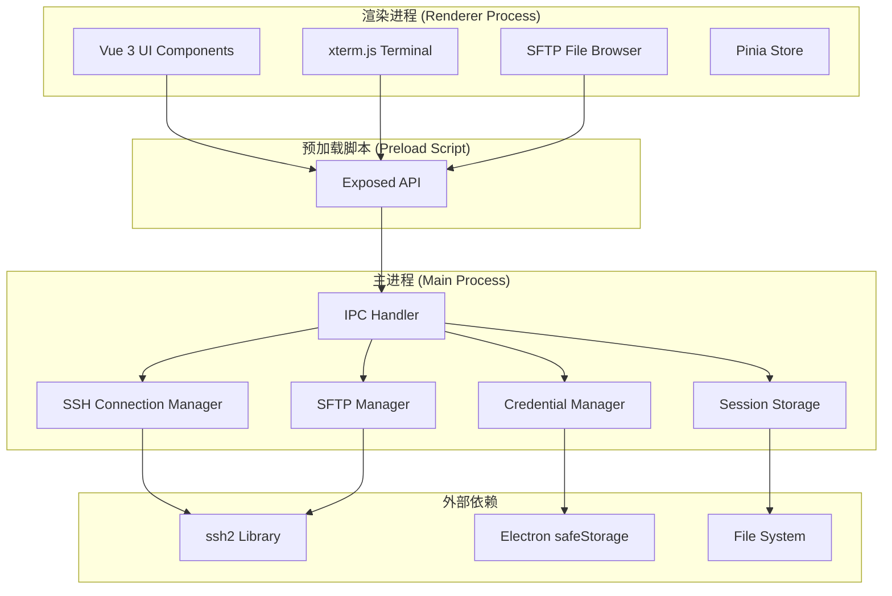

# Design Document: MShell - Windows SSH Client

## Overview

MShell 是一个基于 Electron 框架的 Windows 桌面 SSH 客户端，提供终端连接、SFTP 文件传输、会话管理等功能。本设计采用成熟的开源库（ssh2、xterm.js）而非重新实现 SSH 协议，以确保稳定性和开发效率。

### 技术栈

- **框架**: Electron 28+ (支持最新的 Node.js 和 Chromium)
- **前端框架**: Vue 3 + TypeScript
- **SSH 库**: ssh2 (Node.js 最成熟的 SSH2 协议实现)
- **SFTP 库**: ssh2-sftp-client (基于 ssh2 的高级封装)
- **终端组件**: xterm.js 5.x + 相关插件
  - xterm-addon-fit: 自动调整终端大小
  - xterm-addon-web-links: 支持点击链接
  - xterm-addon-webgl: WebGL 渲染器（性能优化）
  - xterm-addon-search: 终端内搜索
- **UI 组件库**: Element Plus
- **状态管理**: Pinia
- **构建工具**: Vite + electron-builder
- **加密存储**: Electron safeStorage API (使用 Windows DPAPI)

### 架构原则

1. **进程隔离**: 主进程处理 SSH 连接，渲染进程处理 UI，通过 IPC 通信
2. **安全优先**: 启用 contextIsolation，使用 preload 脚本暴露安全 API
3. **性能优化**: 使用 WebGL 渲染终端，流式处理文件传输
4. **可扩展性**: 模块化设计，便于添加新功能

## Architecture

### 系统架构图



### 进程通信模型

**主进程 → 渲染进程**:
- 事件: `ssh:data`, `ssh:error`, `ssh:close`, `sftp:progress`, `sftp:complete`

**渲染进程 → 主进程**:
- 调用: `ssh:connect`, `ssh:write`, `ssh:resize`, `sftp:upload`, `sftp:download`

### 目录结构

```
mshell/
├── electron/
│   ├── main.ts                    # Electron 主进程入口
│   ├── preload.ts                 # 预加载脚本
│   ├── managers/
│   │   ├── SSHConnectionManager.ts    # SSH 连接管理
│   │   ├── SFTPManager.ts             # SFTP 文件传输
│   │   ├── SessionManager.ts          # 会话配置管理
│   │   ├── CredentialManager.ts       # 凭据加密存储
│   │   ├── PortForwardManager.ts      # 端口转发管理
│   │   └── SnippetManager.ts          # 命令片段管理
│   ├── ipc/
│   │   ├── ssh-handlers.ts            # SSH IPC 处理器
│   │   ├── sftp-handlers.ts           # SFTP IPC 处理器
│   │   └── session-handlers.ts        # 会话 IPC 处理器
│   └── utils/
│       ├── encryption.ts              # 加密工具
│       └── logger.ts                  # 日志记录
├── src/
│   ├── main.ts                    # Vue 应用入口
│   ├── App.vue                    # 根组件
│   ├── components/
│   │   ├── Terminal/
│   │   │   ├── TerminalView.vue       # 终端视图
│   │   │   ├── TerminalTab.vue        # 终端标签页
│   │   │   └── TerminalSettings.vue   # 终端设置
│   │   ├── SFTP/
│   │   │   ├── SFTPPanel.vue          # SFTP 双面板
│   │   │   ├── FileList.vue           # 文件列表
│   │   │   ├── TransferQueue.vue      # 传输队列
│   │   │   └── FilePermissions.vue    # 权限编辑
│   │   ├── Session/
│   │   │   ├── SessionList.vue        # 会话列表
│   │   │   ├── SessionForm.vue        # 会话编辑表单
│   │   │   ├── SessionGroup.vue       # 会话分组
│   │   │   └── QuickConnect.vue       # 快速连接
│   │   ├── PortForward/
│   │   │   ├── ForwardList.vue        # 转发列表
│   │   │   └── ForwardForm.vue        # 转发配置
│   │   ├── Snippet/
│   │   │   ├── SnippetList.vue        # 片段列表
│   │   │   └── SnippetEditor.vue      # 片段编辑器
│   │   └── Common/
│   │       ├── Sidebar.vue            # 侧边栏
│   │       ├── Toolbar.vue            # 工具栏
│   │       └── StatusBar.vue          # 状态栏
│   ├── stores/
│   │   ├── session.ts             # 会话状态
│   │   ├── terminal.ts            # 终端状态
│   │   ├── sftp.ts                # SFTP 状态
│   │   ├── settings.ts            # 应用设置
│   │   └── transfer.ts            # 传输队列状态
│   ├── types/
│   │   ├── ssh.ts                 # SSH 类型定义
│   │   ├── sftp.ts                # SFTP 类型定义
│   │   └── session.ts             # 会话类型定义
│   ├── utils/
│   │   ├── terminal-themes.ts     # 终端主题配置
│   │   └── validators.ts          # 输入验证
│   └── assets/
│       ├── styles/
│       └── icons/
├── package.json
├── vite.config.ts
├── electron-builder.json
└── tsconfig.json
```

## Components and Interfaces

### 1. SSH Connection Manager (主进程)

**职责**: 管理 SSH 连接的生命周期，处理认证、数据传输、心跳检测。

**核心接口**:

```typescript
interface SSHConnectionOptions {
  host: string;
  port: number;
  username: string;
  password?: string;
  privateKey?: Buffer;
  passphrase?: string;
  keepaliveInterval?: number;  // 默认 30000ms
  readyTimeout?: number;       // 默认 20000ms
}

interface SSHConnection {
  id: string;
  options: SSHConnectionOptions;
  status: 'connecting' | 'connected' | 'disconnected' | 'error';
  client: ssh2.Client;
  stream?: ssh2.ClientChannel;
  lastActivity: Date;
}

class SSHConnectionManager {
  private connections: Map<string, SSHConnection>;
  
  async connect(id: string, options: SSHConnectionOptions): Promise<void>;
  async disconnect(id: string): Promise<void>;
  write(id: string, data: string): void;
  resize(id: string, cols: number, rows: number): void;
  getConnection(id: string): SSHConnection | undefined;
  startKeepalive(id: string): void;
  stopKeepalive(id: string): void;
}
```

**实现要点**:
- 使用 ssh2.Client 建立连接
- 支持密码和密钥认证（自动检测密钥类型）
- 实现心跳机制：每 30 秒发送 keepalive 包
- 监听 `data`, `close`, `error` 事件并通过 IPC 转发到渲染进程
- 连接失败时提供详细错误信息（认证失败、超时、网络错误等）

### 2. SFTP Manager (主进程)

**职责**: 处理 SFTP 文件操作，支持上传、下载、目录浏览、权限管理。

**核心接口**:

```typescript
interface SFTPFileInfo {
  name: string;
  type: 'file' | 'directory' | 'symlink';
  size: number;
  modifyTime: Date;
  accessTime: Date;
  permissions: number;  // Unix 权限位
  owner: number;
  group: number;
}

interface TransferProgress {
  transferred: number;
  total: number;
  percentage: number;
  speed: number;        // bytes/sec
  eta: number;          // seconds
}

class SFTPManager {
  private sftpClients: Map<string, ssh2.SFTPWrapper>;
  
  async initSFTP(connectionId: string): Promise<void>;
  async listDirectory(connectionId: string, path: string): Promise<SFTPFileInfo[]>;
  async uploadFile(connectionId: string, localPath: string, remotePath: string, 
                   onProgress: (progress: TransferProgress) => void): Promise<void>;
  async downloadFile(connectionId: string, remotePath: string, localPath: string,
                     onProgress: (progress: TransferProgress) => void): Promise<void>;
  async createDirectory(connectionId: string, path: string): Promise<void>;
  async deleteFile(connectionId: string, path: string): Promise<void>;
  async renameFile(connectionId: string, oldPath: string, newPath: string): Promise<void>;
  async changePermissions(connectionId: string, path: string, mode: number): Promise<void>;
}
```

**实现要点**:
- 使用 ssh2-sftp-client 进行文件操作
- 使用流式传输处理大文件（避免内存溢出）
- 实现传输进度回调（每 100ms 更新一次）
- 支持断点续传：检查本地文件大小，使用 `fastPut` 的 `step` 参数
- 批量操作使用队列管理，限制并发数（默认 3）

### 3. Terminal Component (渲染进程)

**职责**: 提供终端 UI，处理用户输入，显示远程输出。

**核心接口**:

```typescript
interface TerminalOptions {
  theme: ITheme;
  fontSize: number;
  fontFamily: string;
  cursorStyle: 'block' | 'underline' | 'bar';
  cursorBlink: boolean;
  scrollback: number;
  rendererType: 'dom' | 'canvas' | 'webgl';
}

class TerminalView {
  private terminal: Terminal;
  private fitAddon: FitAddon;
  private webglAddon?: WebglAddon;
  private searchAddon: SearchAddon;
  
  constructor(container: HTMLElement, options: TerminalOptions);
  
  write(data: string): void;
  clear(): void;
  resize(cols: number, rows: number): void;
  fit(): void;
  focus(): void;
  search(term: string, options?: ISearchOptions): boolean;
  dispose(): void;
  
  onData(callback: (data: string) => void): void;
  onResize(callback: (size: { cols: number; rows: number }) => void): void;
}
```

**实现要点**:
- 优先使用 WebGL 渲染器，降级到 Canvas 或 DOM
- 使用 FitAddon 自动调整终端大小以适应容器
- 监听 `onData` 事件，通过 IPC 发送到主进程
- 监听 `onResize` 事件，通知主进程调整 PTY 大小
- 支持复制粘贴：监听 `Ctrl+C`/`Ctrl+V` 或右键菜单
- 限制滚动缓冲区大小（默认 1000 行）

### 4. Session Manager (主进程)

**职责**: 管理会话配置的 CRUD 操作，支持分组、导入导出。

**核心接口**:

```typescript
interface SessionConfig {
  id: string;
  name: string;
  group?: string;
  host: string;
  port: number;
  username: string;
  authType: 'password' | 'privateKey';
  password?: string;           // 加密存储
  privateKeyPath?: string;
  passphrase?: string;         // 加密存储
  portForwards?: PortForward[];
  color?: string;              // 标签页颜色标识
  createdAt: Date;
  updatedAt: Date;
}

interface SessionGroup {
  id: string;
  name: string;
  sessions: string[];  // session IDs
}

class SessionManager {
  private configPath: string;
  private sessions: Map<string, SessionConfig>;
  private groups: Map<string, SessionGroup>;
  
  async loadSessions(): Promise<void>;
  async saveSessions(): Promise<void>;
  
  createSession(config: Omit<SessionConfig, 'id' | 'createdAt' | 'updatedAt'>): SessionConfig;
  updateSession(id: string, updates: Partial<SessionConfig>): void;
  deleteSession(id: string): void;
  getSession(id: string): SessionConfig | undefined;
  getAllSessions(): SessionConfig[];
  
  createGroup(name: string): SessionGroup;
  addSessionToGroup(sessionId: string, groupId: string): void;
  
  async exportSessions(filePath: string): Promise<void>;
  async importSessions(filePath: string): Promise<SessionConfig[]>;
}
```

**实现要点**:
- 配置文件存储在 `%APPDATA%/mshell/sessions.json`
- 使用 Electron safeStorage 加密敏感字段（password, passphrase）
- 导出时提示用户是否包含密码（安全考虑）
- 导入时验证 JSON 格式和必需字段
- 支持会话搜索和过滤

### 5. Credential Manager (主进程)

**职责**: 安全地加密和解密敏感信息。

**核心接口**:

```typescript
class CredentialManager {
  encrypt(plaintext: string): string;
  decrypt(ciphertext: string): string;
  isEncryptionAvailable(): boolean;
}
```

**实现要点**:
- 使用 Electron `safeStorage.encryptString()` 和 `safeStorage.decryptString()`
- Windows 上使用 DPAPI (Data Protection API)
- 检查 `safeStorage.isEncryptionAvailable()` 确保可用
- 加密后的数据以 Base64 编码存储

### 6. Port Forward Manager (主进程)

**职责**: 管理 SSH 端口转发配置和连接。

**核心接口**:

```typescript
interface PortForward {
  id: string;
  type: 'local' | 'remote' | 'dynamic';
  localHost: string;
  localPort: number;
  remoteHost: string;
  remotePort: number;
  status: 'active' | 'inactive' | 'error';
}

class PortForwardManager {
  async setupLocalForward(connectionId: string, forward: PortForward): Promise<void>;
  async setupRemoteForward(connectionId: string, forward: PortForward): Promise<void>;
  async setupDynamicForward(connectionId: string, localPort: number): Promise<void>;
  async stopForward(forwardId: string): Promise<void>;
  getActiveForwards(connectionId: string): PortForward[];
}
```

**实现要点**:
- 本地转发：使用 `client.forwardOut()`
- 远程转发：使用 `client.forwardIn()`
- 动态转发：实现 SOCKS5 代理服务器
- 监听端口冲突并报错

### 7. Transfer Queue (渲染进程)

**职责**: 管理文件传输任务队列，控制并发和优先级。

**核心接口**:

```typescript
interface TransferTask {
  id: string;
  type: 'upload' | 'download';
  localPath: string;
  remotePath: string;
  size: number;
  status: 'pending' | 'active' | 'paused' | 'completed' | 'failed';
  progress: TransferProgress;
  error?: string;
  priority: number;
}

class TransferQueue {
  private queue: TransferTask[];
  private activeCount: number;
  private maxConcurrent: number = 3;
  
  addTask(task: Omit<TransferTask, 'id' | 'status' | 'progress'>): string;
  pauseTask(taskId: string): void;
  resumeTask(taskId: string): void;
  cancelTask(taskId: string): void;
  retryTask(taskId: string): void;
  setPriority(taskId: string, priority: number): void;
  
  private processQueue(): void;
}
```

**实现要点**:
- 使用优先级队列，高优先级任务先执行
- 限制并发传输数量（可配置）
- 暂停任务时保存已传输的字节数
- 失败任务支持重试（最多 3 次）

## Data Models

### 1. Session Configuration

```typescript
interface SessionConfig {
  id: string;                    // UUID
  name: string;                  // 显示名称
  group?: string;                // 分组名称
  host: string;                  // 主机地址
  port: number;                  // 端口（默认 22）
  username: string;              // 用户名
  authType: 'password' | 'privateKey';
  password?: string;             // 加密存储
  privateKeyPath?: string;       // 私钥文件路径
  passphrase?: string;           // 私钥密码（加密存储）
  portForwards?: PortForward[];  // 端口转发配置
  color?: string;                // 标签页颜色
  terminalSettings?: {
    fontSize: number;
    fontFamily: string;
    theme: string;
  };
  createdAt: Date;
  updatedAt: Date;
}
```

### 2. Connection State

```typescript
interface ConnectionState {
  id: string;
  sessionId: string;
  status: 'connecting' | 'connected' | 'disconnected' | 'error';
  connectedAt?: Date;
  lastActivity: Date;
  error?: string;
  serverInfo?: {
    banner: string;
    hostKey: string;
  };
}
```

### 3. SFTP File Entry

```typescript
interface SFTPFileEntry {
  name: string;
  path: string;                  // 完整路径
  type: 'file' | 'directory' | 'symlink';
  size: number;                  // 字节
  modifyTime: Date;
  accessTime: Date;
  permissions: {
    mode: number;                // Unix 权限位 (e.g., 0o755)
    user: { read: boolean; write: boolean; execute: boolean };
    group: { read: boolean; write: boolean; execute: boolean };
    others: { read: boolean; write: boolean; execute: boolean };
  };
  owner: number;                 // UID
  group: number;                 // GID
}
```

### 4. Transfer Task

```typescript
interface TransferTask {
  id: string;
  connectionId: string;
  type: 'upload' | 'download';
  localPath: string;
  remotePath: string;
  fileName: string;
  size: number;
  status: 'pending' | 'active' | 'paused' | 'completed' | 'failed';
  progress: {
    transferred: number;
    total: number;
    percentage: number;
    speed: number;               // bytes/sec
    eta: number;                 // seconds
  };
  error?: string;
  priority: number;              // 0-10, 默认 5
  createdAt: Date;
  startedAt?: Date;
  completedAt?: Date;
}
```

### 5. Command Snippet

```typescript
interface CommandSnippet {
  id: string;
  name: string;
  description?: string;
  command: string;               // 支持变量 ${varName}
  variables?: {
    name: string;
    description: string;
    defaultValue?: string;
  }[];
  tags: string[];
  category?: string;
  createdAt: Date;
  usageCount: number;
}
```

### 6. Application Settings

```typescript
interface AppSettings {
  general: {
    language: 'zh-CN' | 'en-US';
    theme: 'light' | 'dark' | 'auto';
    startWithSystem: boolean;
    minimizeToTray: boolean;
  };
  terminal: {
    defaultFontSize: number;
    defaultFontFamily: string;
    defaultTheme: string;
    scrollback: number;
    cursorStyle: 'block' | 'underline' | 'bar';
    cursorBlink: boolean;
    rendererType: 'auto' | 'webgl' | 'canvas' | 'dom';
  };
  sftp: {
    maxConcurrentTransfers: number;
    defaultLocalPath: string;
    confirmBeforeDelete: boolean;
    showHiddenFiles: boolean;
  };
  security: {
    savePasswords: boolean;
    sessionTimeout: number;      // 分钟，0 表示不超时
    verifyHostKey: boolean;
  };
  updates: {
    autoCheck: boolean;
    autoDownload: boolean;
  };
}
```

### 7. Connection Log Entry

```typescript
interface ConnectionLogEntry {
  id: string;
  sessionId: string;
  sessionName: string;
  host: string;
  username: string;
  action: 'connect' | 'disconnect' | 'error';
  timestamp: Date;
  details?: string;
  error?: string;
}
```

## Correctness Properties

*属性（Property）是关于系统行为的形式化陈述，应该在所有有效执行中保持为真。属性是人类可读规范和机器可验证正确性保证之间的桥梁。*


### Property 1: 有效连接参数建立连接

*对于任意*有效的主机地址、端口、用户名和认证凭据（密码或私钥），SSH_Client 应该能够成功建立连接，连接状态变为 'connected'。

**Validates: Requirements 1.1, 1.2**

### Property 2: 支持多种密钥类型

*对于任意*支持的密钥类型（RSA、ED25519、ECDSA），使用该类型的有效密钥进行认证应该能够成功建立连接。

**Validates: Requirements 1.7**

### Property 3: 无效连接参数返回错误

*对于任意*无效的连接参数或不可达的服务器，SSH_Client 应该返回明确的错误信息而不是崩溃或挂起。

**Validates: Requirements 1.4**

### Property 4: 连接保持和心跳

*对于任意*成功建立的连接，SSH_Client 应该启动心跳机制，定期发送 keepalive 包以保持连接活跃。

**Validates: Requirements 1.5, 11.5**

### Property 5: 连接断开检测

*对于任意*意外断开的连接，SSH_Client 应该能够检测到断开状态并更新连接状态为 'disconnected'。

**Validates: Requirements 1.6**

### Property 6: 终端输入转发

*对于任意*用户在终端输入的字符串，Terminal_Component 应该将输入通过 SSH 连接发送到远程服务器。

**Validates: Requirements 2.2**

### Property 7: 终端输出显示

*对于任意*远程服务器返回的输出数据，Terminal_Component 应该实时显示在终端界面中。

**Validates: Requirements 2.3**

### Property 8: 特殊键处理

*对于任意*特殊键（Ctrl+C、Tab、方向键等），Terminal_Component 应该发送对应的正确控制序列到远程服务器。

**Validates: Requirements 2.4**

### Property 9: ANSI 代码支持

*对于任意*包含 ANSI 颜色代码和格式化的输出，Terminal_Component 应该正确解析并渲染。

**Validates: Requirements 2.5**

### Property 10: 终端窗口调整

*对于任意*终端窗口大小调整操作，Terminal_Component 应该更新终端尺寸并通知远程服务器调整 PTY 大小。

**Validates: Requirements 2.6**

### Property 11: 粘贴内容发送

*对于任意*剪贴板内容，当用户执行粘贴操作时，Terminal_Component 应该将内容发送到终端。

**Validates: Requirements 2.8**

### Property 12: 会话配置持久化

*对于任意*会话配置的创建、更新或删除操作，Session_Manager 应该正确地将变更持久化到本地存储，并且能够在后续读取时恢复正确的状态。

**Validates: Requirements 3.1, 3.2, 3.3**

### Property 13: 会话配置加载

*对于任意*已保存的会话配置集合，当应用启动时，Session_Manager 应该加载所有配置并使其可用。

**Validates: Requirements 3.5**

### Property 14: 使用保存配置连接

*对于任意*已保存的会话配置，当用户选择该配置建立连接时，SSH_Client 应该使用配置中的参数（主机、端口、用户名、认证方式）进行连接。

**Validates: Requirements 3.6**

### Property 15: 会话配置往返一致性

*对于任意*会话配置集合，导出为 JSON 文件后再导入，应该得到等价的配置集合（除了可能的 ID 重新生成）。

**Validates: Requirements 3.7, 3.8**

### Property 16: 敏感信息加密存储

*对于任意*包含敏感信息（密码、私钥密码）的会话配置，Session_Manager 应该使用加密算法存储这些信息，存储的数据不应该是明文。

**Validates: Requirements 3.9, 10.1**

### Property 17: 并发连接支持

*对于任意*数量的并发 SSH 连接请求（在合理范围内），SSH_Client 应该能够同时维护多个活跃连接，每个连接独立运行。

**Validates: Requirements 4.2**

### Property 18: 连接资源清理

*对于任意*关闭的连接，SSH_Client 应该断开 SSH 连接并释放相关资源（内存、文件描述符等）。

**Validates: Requirements 4.4**

### Property 19: SFTP 会话初始化

*对于任意*成功建立的 SSH 连接，SFTP_Manager 应该能够基于该连接初始化 SFTP 会话。

**Validates: Requirements 5.1**

### Property 20: 远程目录列表

*对于任意*远程目录路径，SFTP_Manager 应该能够列出目录内容，返回文件名、大小、权限、修改时间等信息。

**Validates: Requirements 5.3**

### Property 21: 文件传输往返一致性

*对于任意*本地文件，上传到远程服务器后再下载回来，文件内容应该保持一致（字节级相同）。

**Validates: Requirements 5.4, 5.5**

### Property 22: 批量文件传输

*对于任意*多个文件的批量传输请求，SFTP_Manager 应该能够成功传输所有文件，每个文件的传输结果独立。

**Validates: Requirements 5.7**

### Property 23: 传输进度报告

*对于任意*文件传输操作，SFTP_Manager 应该定期报告传输进度，包括已传输字节数、百分比、速度和预计剩余时间，且这些数据应该合理（如百分比在 0-100 之间）。

**Validates: Requirements 5.8**

### Property 24: 断点续传

*对于任意*传输过程中中断的文件，当连接恢复后，SFTP_Manager 应该能够从断点继续传输，而不是重新开始。

**Validates: Requirements 5.9**

### Property 25: 远程文件操作

*对于任意*远程文件或目录，SFTP_Manager 应该支持创建、删除、重命名操作，操作后远程文件系统状态应该正确反映变更。

**Validates: Requirements 5.10**

### Property 26: 文件权限修改

*对于任意*远程文件和有效的权限模式（Unix 权限位），SFTP_Manager 应该能够修改文件权限，修改后查询文件权限应该返回新的权限值。

**Validates: Requirements 5.11**

### Property 27: 终端设置可配置

*对于任意*终端设置项（主题、字体大小、字体系列、光标样式、滚动缓冲区大小、透明度），Terminal_Component 应该支持配置，配置后新建的终端应该使用新设置。

**Validates: Requirements 6.1, 6.2, 6.3, 6.4, 6.5, 6.6, 6.7**

### Property 28: 本地端口转发

*对于任意*有效的本地端口转发配置（本地端口、远程主机、远程端口），SSH_Client 应该能够监听本地端口，并将连接到该端口的流量转发到远程地址。

**Validates: Requirements 7.2**

### Property 29: 远程端口转发

*对于任意*有效的远程端口转发配置，SSH_Client 应该能够在远程服务器上监听端口，并将流量转发到本地地址。

**Validates: Requirements 7.4**

### Property 30: 端口转发错误处理

*对于任意*无效的端口转发配置（如端口已被占用），SSH_Client 应该返回明确的错误信息而不是静默失败。

**Validates: Requirements 7.7**

### Property 31: 端口转发配置持久化

*对于任意*包含端口转发规则的会话配置，保存后再加载，端口转发规则应该被正确恢复。

**Validates: Requirements 7.8**

### Property 32: 命令片段持久化

*对于任意*命令片段（包含命令文本、描述、标签、分类），创建后应该能够从存储中读取回来，内容保持一致。

**Validates: Requirements 8.2**

### Property 33: 命令片段插入

*对于任意*选择的命令片段，SSH_Client 应该将片段的命令文本插入到当前活跃的终端中。

**Validates: Requirements 8.4**

### Property 34: 片段变量替换

*对于任意*包含变量占位符的命令片段和提供的变量值，SSH_Client 应该正确替换所有变量占位符为对应的值。

**Validates: Requirements 8.5**

### Property 35: 命令片段往返一致性

*对于任意*命令片段库，导出后再导入，应该得到等价的片段集合。

**Validates: Requirements 8.7**

### Property 36: 连接事件日志记录

*对于任意*SSH 连接的建立或断开事件，SSH_Client 应该记录日志条目，包含时间戳、主机、用户名和事件类型。

**Validates: Requirements 9.1, 9.2**

### Property 37: 会话输出日志记录

*对于任意*启用了会话日志的终端，所有输入和输出应该被记录到日志文件中。

**Validates: Requirements 9.4**

### Property 38: 日志过滤

*对于任意*日志过滤条件（时间范围、主机名），SSH_Client 应该返回符合条件的日志条目，不符合条件的应该被排除。

**Validates: Requirements 9.6, 14.6**

### Property 39: 错误日志详细信息

*对于任意*发生的错误，SSH_Client 应该记录详细的错误信息和堆栈跟踪到日志中。

**Validates: Requirements 9.7**

### Property 40: 日志不包含敏感信息

*对于任意*日志条目，不应该包含密码、私钥内容等敏感信息的明文。

**Validates: Requirements 10.3**

### Property 41: 主机密钥验证

*对于任意*SSH 连接，SSH_Client 应该验证服务器的主机密钥，如果密钥与已知主机列表不匹配，应该发出警告。

**Validates: Requirements 10.5, 10.7**

### Property 42: 历史缓冲区大小限制

*对于任意*终端，历史缓冲区的大小不应该超过配置的最大值，超出部分应该被丢弃。

**Validates: Requirements 11.4**

### Property 43: 心跳间隔可配置

*对于任意*有效的心跳间隔配置值，SSH_Client 应该按照该间隔发送心跳包。

**Validates: Requirements 11.6**

### Property 44: 崩溃恢复

*对于任意*应用崩溃前的会话配置状态，重启后应该能够恢复这些配置。

**Validates: Requirements 11.7**

### Property 45: 快捷键操作

*对于任意*配置的快捷键（新建连接、关闭标签、切换标签等），按下快捷键应该触发对应的操作。

**Validates: Requirements 12.4**

### Property 46: 操作失败错误提示

*对于任意*失败的操作，SSH_Client 应该显示包含错误原因的友好提示信息。

**Validates: Requirements 12.6**

### Property 47: 多语言支持

*对于任意*支持的语言（中文、英文），SSH_Client 应该能够切换界面语言，所有 UI 文本应该使用对应语言显示。

**Validates: Requirements 12.7**

### Property 48: 主题切换

*对于任意*支持的应用主题（深色、浅色），SSH_Client 应该能够切换主题，UI 应该使用对应主题的颜色方案。

**Validates: Requirements 12.8**

### Property 49: 传输任务队列管理

*对于任意*多个文件传输任务，Transfer_Queue 应该将它们加入队列，并按照优先级和并发限制顺序执行。

**Validates: Requirements 13.1**

### Property 50: 传输任务暂停和恢复

*对于任意*进行中的传输任务，暂停后状态应该变为 'paused'，恢复后应该继续传输并最终完成。

**Validates: Requirements 13.3, 13.4**

### Property 51: 传输任务取消

*对于任意*传输任务，取消后任务应该停止，状态变为 'cancelled'，且相关的临时文件应该被清理。

**Validates: Requirements 13.5**

### Property 52: 传输任务优先级

*对于任意*传输队列中的任务，调整优先级后，高优先级任务应该在低优先级任务之前执行（在并发限制内）。

**Validates: Requirements 13.6**

### Property 53: 并发传输数量限制

*对于任意*配置的最大并发传输数量，Transfer_Queue 同时执行的传输任务数量不应该超过该限制。

**Validates: Requirements 13.7**

### Property 54: 会话搜索

*对于任意*会话列表和搜索关键词，SSH_Client 应该返回名称或主机包含该关键词的所有会话。

**Validates: Requirements 14.1**

### Property 55: 终端文本搜索

*对于任意*终端输出内容和搜索文本，Terminal_Component 应该能够找到所有匹配的位置。

**Validates: Requirements 14.2**

### Property 56: 正则表达式搜索

*对于任意*有效的正则表达式模式，Terminal_Component 应该能够使用该模式搜索终端内容，返回所有匹配项。

**Validates: Requirements 14.4**

### Property 57: 命令历史搜索

*对于任意*命令历史和搜索关键词，SSH_Client 应该返回包含该关键词的所有历史命令。

**Validates: Requirements 14.5**

### Property 58: 启动时检查更新

*对于任意*应用启动，SSH_Client 应该检查是否有新版本可用（如果启用了自动更新检查）。

**Validates: Requirements 15.1**

### Property 59: 自动下载更新

*对于任意*发现的新版本，如果启用了自动下载，SSH_Client 应该下载更新包到本地。

**Validates: Requirements 15.3**

### Property 60: 更新前配置备份

*对于任意*更新操作，SSH_Client 应该在更新前备份用户配置，备份文件应该包含所有会话配置和设置。

**Validates: Requirements 15.6**

## Error Handling

### 连接错误处理

1. **认证失败**: 返回明确的错误信息（"密码错误" 或 "密钥认证失败"），不泄露敏感信息
2. **网络超时**: 设置合理的超时时间（默认 20 秒），超时后返回 "连接超时" 错误
3. **主机不可达**: 捕获网络错误，返回 "无法连接到主机" 错误
4. **主机密钥变化**: 警告用户可能的中间人攻击，提供选项：信任新密钥或取消连接

### SFTP 错误处理

1. **权限拒绝**: 返回 "权限不足" 错误，提示用户检查文件权限
2. **文件不存在**: 返回 "文件或目录不存在" 错误
3. **磁盘空间不足**: 检测磁盘空间，传输前警告用户
4. **传输中断**: 保存断点信息，支持恢复传输

### 应用级错误处理

1. **配置文件损坏**: 尝试恢复，失败则使用默认配置，提示用户
2. **加密不可用**: 检查 safeStorage 可用性，不可用时警告用户密码将不加密存储
3. **端口冲突**: 检测端口占用，返回明确的错误信息
4. **内存不足**: 限制缓冲区大小，避免内存溢出

### 错误恢复策略

1. **自动重连**: 连接意外断开时，提供重连选项（可配置自动重连）
2. **断点续传**: 文件传输中断后，支持从断点继续
3. **配置备份**: 定期备份配置文件，损坏时可恢复
4. **日志记录**: 所有错误记录到日志文件，便于问题排查

## Testing Strategy

### 单元测试

单元测试用于验证特定示例、边缘情况和错误条件。重点测试：

1. **SSH 连接管理器**:
   - 测试密码认证成功/失败
   - 测试密钥认证成功/失败
   - 测试连接超时处理
   - 测试心跳机制启动/停止

2. **SFTP 管理器**:
   - 测试文件上传/下载成功
   - 测试权限拒绝错误处理
   - 测试大文件流式传输
   - 测试断点续传逻辑

3. **会话管理器**:
   - 测试配置 CRUD 操作
   - 测试 JSON 导入/导出
   - 测试加密/解密功能
   - 测试配置文件损坏恢复

4. **传输队列**:
   - 测试任务添加/移除
   - 测试优先级排序
   - 测试并发限制
   - 测试暂停/恢复/取消

5. **凭据管理器**:
   - 测试加密存储
   - 测试解密读取
   - 测试加密不可用时的降级处理

### 属性测试

属性测试用于验证通用属性在所有输入下都成立。使用 **fast-check** (JavaScript/TypeScript 的属性测试库) 实现。

**配置要求**:
- 每个属性测试至少运行 **100 次迭代**
- 每个测试必须标注对应的设计文档属性编号
- 标注格式: `// Feature: windows-ssh-client, Property N: [property description]`

**测试覆盖**:

1. **连接属性** (Properties 1-5):
   - 生成随机有效/无效连接参数
   - 验证连接状态转换正确性
   - 验证心跳和断开检测

2. **终端属性** (Properties 6-11):
   - 生成随机输入字符串
   - 生成随机 ANSI 代码序列
   - 验证输入输出正确转发

3. **会话管理属性** (Properties 12-16):
   - 生成随机会话配置
   - 验证 CRUD 操作持久化
   - 验证导入导出往返一致性
   - 验证加密存储

4. **SFTP 属性** (Properties 19-26):
   - 生成随机文件内容和路径
   - 验证上传下载往返一致性
   - 验证文件操作正确性
   - 验证权限修改

5. **端口转发属性** (Properties 28-31):
   - 生成随机端口转发配置
   - 验证转发功能和错误处理

6. **命令片段属性** (Properties 32-35):
   - 生成随机片段内容
   - 验证变量替换正确性
   - 验证导入导出往返一致性

7. **日志属性** (Properties 36-40):
   - 验证所有事件都被记录
   - 验证日志过滤正确性
   - 验证敏感信息不泄露

8. **传输队列属性** (Properties 49-53):
   - 生成随机传输任务
   - 验证队列管理和优先级
   - 验证并发限制

9. **搜索属性** (Properties 54-57):
   - 生成随机搜索关键词
   - 验证搜索结果正确性

### 集成测试

集成测试验证组件之间的交互：

1. **端到端连接流程**:
   - 创建会话 → 建立连接 → 执行命令 → 断开连接
   - 验证整个流程无错误

2. **SFTP 完整流程**:
   - 建立连接 → 初始化 SFTP → 上传文件 → 下载文件 → 验证内容一致

3. **端口转发流程**:
   - 建立连接 → 配置转发 → 测试流量转发 → 停止转发

4. **会话恢复流程**:
   - 保存会话 → 关闭应用 → 重启应用 → 验证会话恢复

### 测试工具和框架

- **单元测试**: Vitest
- **属性测试**: fast-check
- **E2E 测试**: Playwright (用于 Electron 应用测试)
- **Mock SSH 服务器**: ssh2 的测试工具或 Docker 容器运行真实 SSH 服务器
- **覆盖率**: 目标 80% 代码覆盖率

### 测试数据生成

使用 fast-check 的 arbitraries 生成测试数据：

```typescript
// 示例：生成随机会话配置
const sessionConfigArbitrary = fc.record({
  name: fc.string({ minLength: 1, maxLength: 50 }),
  host: fc.domain(),
  port: fc.integer({ min: 1, max: 65535 }),
  username: fc.string({ minLength: 1, maxLength: 32 }),
  authType: fc.constantFrom('password', 'privateKey'),
  password: fc.option(fc.string({ minLength: 8 })),
});

// 示例：生成随机文件内容
const fileContentArbitrary = fc.uint8Array({ minLength: 0, maxLength: 1024 * 1024 });
```

### 持续集成

- 所有测试在 CI 环境中自动运行
- 属性测试使用固定种子以确保可重现性
- 失败的属性测试应该输出反例以便调试
